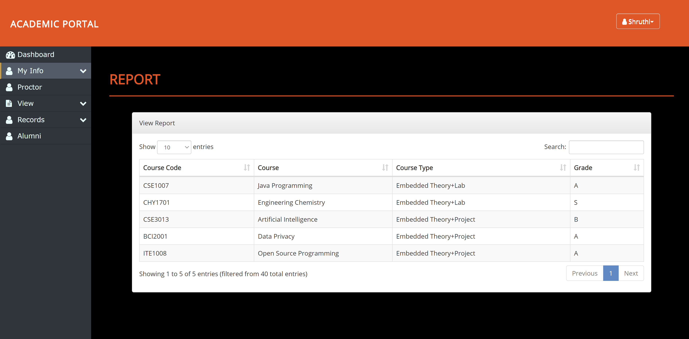

# Academic Portal

An academic portal for faculties and students.




## Getting Started

Clone the repository using the following command and copy the cloned repo folder 'Portal' and paste it into the htdocs folder inside the xampp folder which is installed by default into the C drive of your computer.

```
git clone <http url>
```

Open the xampp control panel and start the Apache and MySQL Service.

Click on the Admin button of MySQL and create a database called 'portal' and import the portal.sql file.

Open your browser and type in the url :

```
http://localhost/Portal
```
The login details can be obtained from the user table and can be modified accordingly.

## Website features

1. Unique User-ID and password for each user
2. Personal information of the current user is displayed using their session-ID
3. Dynamic search bar in each table
4. Advanced filter with multiple criteria to display alumni details
5. Safe from sql injection attacks

## Role Activity

1. Faculty

- View personal information
- View proctee details
- View student details enrolled under them
- Modify marks of students under them and the test schedule (date and time)
- View academic and extracurricular records (including their time table) of every student 
- View alumni details based on multiple criteria


2. Student

- View personal information
- View proctor details
- View academic and extracurricular details
- View alumni details based on multiple criteria
